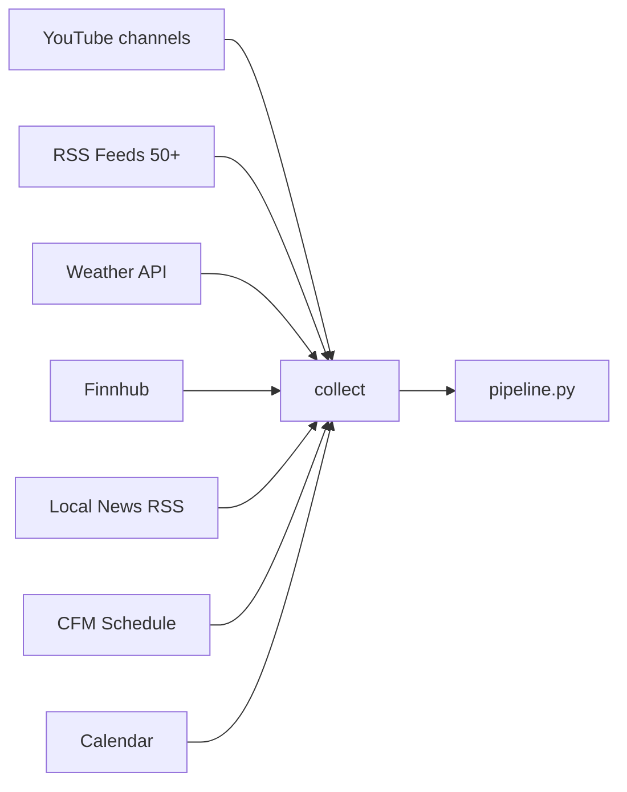
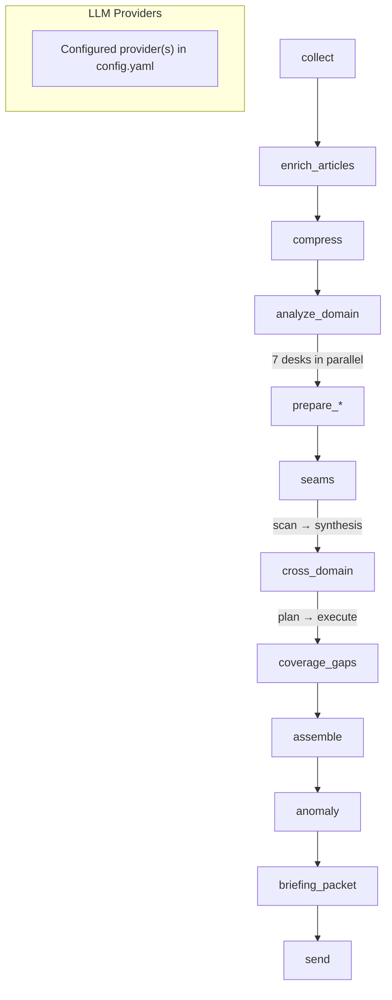

# Morning Digest

A self-hosted daily briefing email generated by AI, tailored to your interests. Runs as a Docker container on Unraid (or anywhere Docker runs).

> **All pipeline commands must be run inside Docker.** Dependencies (yt-dlp, Python packages, etc.) are only installed in the container — not on the host. See [Running Manually](#running-manually) for the exact commands.

## What It Does

Every morning at 6:00 AM MT, this container:

1. **Collects** data from multiple sources:
   - YouTube analysis channels (yt-dlp — transcripts from configured channels, no API key)
   - RSS feeds (50+ categorized feeds: non-western press, defense/military, geopolitics, AI/tech, economics, energy/materials, science/biotech, legal/institutional, cybersecurity, demographics, and more)
   - Local news RSS (Cache Valley Daily, Herald Journal)
   - NWS weather (primary) with Open-Meteo fallback, AirNow AQI, NOAA normals/records
   - Finnhub market quotes (SPY, DIA, XAR, XLE)
   - Space launch schedule (Launch Library 2)
   - Holidays and church events
   - Come Follow Me lesson schedule (LDS)

2. **Processes** sources through a staged AI pipeline (`pipeline.py`):
   - **collect** — Fetches all sources (RSS, YouTube transcripts, weather, markets, CFM)
   - **enrich_articles** — Normalizes RSS items to canonical sanitized summaries using native RSS body fields or fetched article text
   - **compress** — Pre-compresses YouTube transcripts to ~400–800 word summaries
   - **analyze_domain** — Seven specialist desks run in parallel: geopolitics, defense/space, AI/tech, energy/materials, culture/structural, science/biotech, economics
   - **prepare_*** — Calendar, weather (HTML email-safe chart), spiritual, local news enrichment passes
   - **seams** — Two-turn adversarial review: scan for tensions/absences/assumptions, then synthesize into contested narratives, coverage gaps, key assumptions
   - **cross_domain** — Two-turn editor-in-chief synthesis: plan (editorial decisions) then execute (at-a-glance, deep dives, worth reading)
   - **coverage_gaps** — Diagnostic blind-spot detection with recurring pattern history; stored as artifacts and shown only in dry-run diagnostics
   - **assemble** — Renders HTML digest from all stage outputs
   - **anomaly** — Post-assembly behavioral checks: category skew, source absence, unusual deep dives, length drift, repeated phrases
   - **briefing_packet** — Builds compressed JSON context for follow-up chat (writes `output/latest_briefing_packet.json`)
   - **send** — SMTP delivery

3. **Renders** the output into a polished HTML email

4. **Delivers** the email to your inbox via SMTP

## Architecture

### Data Sources



### Pipeline Flow



## Quick Start

### 1. Get your API keys

| Key | Where | Free? |
|-----|-------|-------|
| LLM provider API key(s) | Your configured provider account(s) | Depends on provider/model |
| Finnhub API | [finnhub.io](https://finnhub.io) | Free tier |
| Gmail App Password | [myaccount.google.com/apppasswords](https://myaccount.google.com/apppasswords) | Yes |

### 2. Configure

```bash
cp .env.example .env
# Edit .env with your API keys

# Edit config.yaml:
# - Set delivery.to_address to your email address
# - Adjust topics, channels, feeds, and schedule as desired
```

### 3. Build and test

```bash
# Build the container
docker compose build

# Collect all sources and dump to output/sources.json (no AI call)
docker compose run --rm morning-digest python pipeline.py --sources-only

# Full pipeline: collect + AI + render HTML, saved to output/last_digest.html (no email)
docker compose run --rm morning-digest python pipeline.py --dry-run

# Production: full pipeline + send email
docker compose run --rm morning-digest python pipeline.py
```

### 4. Deploy to Unraid

See the [Unraid section](#unraid) below.

---

## Running Manually

**All pipeline commands run inside Docker** — yt-dlp, Python packages, and other dependencies live only in the container image.

### If the container is stopped (one-off run)

```bash
docker compose run --rm morning-digest python pipeline.py --sources-only
docker compose run --rm morning-digest python pipeline.py --dry-run
docker compose run --rm morning-digest python pipeline.py
```

### If the container is already running (scheduled mode)

```bash
docker exec -it morning-digest python pipeline.py --dry-run
```

### All pipeline flags

```bash
python pipeline.py                         # full run (collect + AI + send)
python pipeline.py --dry-run               # full run, save HTML only (no email)
python pipeline.py --sources-only          # collect and dump output/sources.json, stop before AI
python pipeline.py --lookback-hours 72     # override YouTube lookback window
python pipeline.py --stage cross_domain    # re-run from a specific stage (loads prior artifacts)
python pipeline.py --stage cross_domain --from-plan  # reuse today's editorial plan, re-run execution only
```

### Checking output

After a `--dry-run`:

- `output/last_digest.html` — full rendered digest (open in browser)
- `output/latest_briefing_packet.json` — compressed context packet for follow-up chat
- `output/artifacts/YYYY-MM-DD/` — per-stage JSON artifacts (`raw_sources`, `domain_analysis`, `seam_scan`, `cross_domain_plan`, `coverage_gaps`, `anomaly_report`, etc.)
- `output/digest.log` — pipeline log with stage timings

---

## Unraid

### Option A: Compose Manager plugin (recommended)

This is the cleanest approach if you have the [Compose Manager](https://forums.unraid.net/topic/114415-plugin-docker-compose-manager/) plugin installed.

**1. Copy the project to appdata:**

```bash
mkdir -p /mnt/user/appdata/morning-digest
cp -r . /mnt/user/appdata/morning-digest/
```

**2. Create your `.env` file:**

```bash
cd /mnt/user/appdata/morning-digest
cp .env.example .env
nano .env   # fill in your keys
```

**3. Edit `config.yaml`** — set your `delivery.to_address` and adjust preferences.

**4. In the Unraid UI:**

- Go to **Docker → Compose** tab
- Click **Add Stack**
- Name it `morning-digest`
- Point the compose file path to `/mnt/user/appdata/morning-digest/docker-compose.yml`
- Click **Up** to start

**5. Test it:**

Open an Unraid terminal and run:

```bash
cd /mnt/user/appdata/morning-digest
docker compose run --rm morning-digest python pipeline.py --dry-run
```

Then check `output/last_digest.html` — copy the path and open it in a browser via Unraid's file manager, or `scp` it to your machine.

---

### Option B: Unraid Docker UI (manual)

If you don't use the Compose plugin, you'll need to pre-build the image.

**1. Build the image on your machine (or on Unraid via terminal):**

```bash
cd /mnt/user/appdata/morning-digest
docker build -t morning-digest:latest .
```

**2. In the Unraid Docker tab → Add Container:**

| Field | Value |
|-------|-------|
| Name | `morning-digest` |
| Repository | `morning-digest:latest` |
| Network Type | Bridge |
| Restart | `unless-stopped` |

**3. Add these Environment Variables:**

| Variable | Value |
|----------|-------|
| `TZ` | `America/Denver` |
| Provider API key(s) | keys required by the models/providers configured in `config.yaml` |
| `FINNHUB_API_KEY` | your Finnhub key |
| `SMTP_USER` | your email address |
| `SMTP_PASSWORD` | your Gmail App Password (or SMTP password) |

**4. Add these Path mappings:**

| Container path | Host path | Access |
|---------------|-----------|--------|
| `/app/config.yaml` | `/mnt/user/appdata/morning-digest/config.yaml` | Read Only |
| `/app/output` | `/mnt/user/appdata/morning-digest/output` | Read/Write |

**5. Click Apply.** The container will start and wait until 6:00 AM MT to send the first digest.

---

### Rebuilding after updates

When you pull changes from git, **always rebuild the image** — only `config.yaml` and `output/` are volume-mounted, so Python code changes require a rebuild:

```bash
cd /mnt/user/appdata/morning-digest
git pull
docker compose build
docker compose up -d
```

If using the Unraid Docker UI (Option B):

```bash
docker build -t morning-digest:latest .
# Then in Unraid Docker UI: Force Update the container
```

---

## Configuration Reference

### config.yaml

**`schedule.cron`** — When to send. Default: `0 6 * * *` (6:00 AM daily)

**`delivery.to_address`** — Your email address (required)

**`pipeline.stages`** — Ordered list of pipeline stages with optional per-stage model config. Each stage maps to `stages/<name>.py`.

**`llm.model`** — Default AI model. Individual stages can override provider/model settings in `pipeline.stages`.

**`digest.worth_reading`** — long-form pieces worth setting aside time for. Selected by the `cross_domain` stage as part of the normal daily digest.

**`topics.primary / secondary / tertiary`** — Topic priority tiers used to steer editorial selection in the digest.

**`youtube.analysis_channels`** — Channels whose transcripts are fetched, compressed, and fed into synthesis. Uses `handle` (the `@username` on YouTube).

**`youtube.lookback_hours`** — How far back to look for new videos (default: 48)

**`desks`** — Desk manifest mapping desk names to RSS feed categories. Each desk runs a specialist analysis pass in parallel. The desk names must exist in `stages/analyze_domain.py` (`_DOMAIN_CONFIGS`); the manifest controls which categories feed each active desk. All desks currently share `prompts/analyze_domain_system.md`.

```yaml
desks:
  - { name: "geopolitics", categories: ["non-western", "substack-independent", "global-south", "western-analysis"] }
  - { name: "energy_materials", categories: ["energy-materials"] }
```

**`pipeline.stages[].turns.<name>`** — Per-turn model overrides for two-turn stages (`seams`, `cross_domain`). Override `max_tokens`, `temperature`, or `model` for individual turns without changing the stage default.

```yaml
- name: seams
  model: { provider: "...", model: "...", max_tokens: 5000, temperature: 0.3 }
  turns:
    scan: { max_tokens: 4000, temperature: 0.4 }
    synthesis: { max_tokens: 5000, temperature: 0.3 }
```

**`rss.feeds`** — Feed list with optional `cap` (max items per feed) and `category` for editorial treatment.

**`enrich_articles`** — RSS summary normalization. The stage chooses the best native RSS text first, fetches article HTML only when configured or when native text is too thin, and writes one canonical sanitized `summary` for downstream stages.

```yaml
enrich_articles:
  enabled: true
  min_usable_chars: 200
  summarize_above_chars: 800
  canonical_summary_max_chars: 700
  max_fetches_per_run: 60
  cache_ttl_days: 30
  cache_failure_backoff_hours: 24
  per_host_concurrency: 2
  per_host_min_interval_ms: 500
```

Per-feed overrides live under `rss.feeds[].enrich`:

```yaml
enrich:
  strategy: "auto"  # auto | rss_only | fetch | fetch_with_cookies | skip
  cookies_file: "cookies/atlantic.cookies.txt"
  min_body_chars: 500
  timeout_seconds: 30
```

Cached article records live in `cache/article_bodies/`. Provenance and before/after lengths are written to `output/artifacts/YYYY-MM-DD/enrich_articles.json`, not to prompt-visible RSS fields.

### Authenticated Fetches

Subscription sites can use browser-exported Netscape `cookies.txt` files. Put domain-scoped cookie files in `cookies/` at the project root; the directory is gitignored and mounted read-only into Docker. Reference the in-container path from `enrich.cookies_file`.

When `enrich_articles.json` starts showing `paywall` for a feed that should have authenticated access, refresh the cookie export.

### RSS Quality Audit

Run the audit manually to identify thin feeds, paywall-heavy feeds, and stale cookies:

```bash
docker compose run --rm --entrypoint "" morning-digest python scripts/audit_rss_quality.py
docker compose run --rm --entrypoint "" morning-digest \
  python scripts/audit_rss_quality.py --window 30 --output output/audits/rss_quality_$(date -u +%F).md
```

The `Recommend` column suggests `strategy: "fetch"`, `strategy: "rss_only"`, `strategy: "skip"`, cookie refreshes, or `ok`.

**`markets.symbols`** — Finnhub ticker symbols. ETFs work on free tier; raw indices (`^GSPC`) do not.

### RSS feed categories

The digest applies different editorial treatment to each category:

| Category | Treatment |
|----------|-----------|
| `non-western` | "What's missing" layer — flag when framing diverges from wire coverage |
| `western-analysis` | "What it means" — interpretation and framing |
| `defense-mil` | Defense and military news |
| `substack-independent` | Geopolitics and independent analysis |
| `ai-tech` | AI, LLMs, and software |
| `econ-trade` | Economics and trade |
| `global-south` | Global South perspective |
| `perspective-diversity` | "Stress test" layer — surface only when contradicting consensus |
| `cyber` | Cybersecurity |
| `energy-materials` | Physical substrate: power, raw materials, grid, industrial capacity |
| `culture-structural` | Institutional shifts — not entertainment or discourse-chasing |
| `science-biotech` | Frontier science and biotech with geopolitical/economic implications |
| `legal-institutional` | Legal analysis, Supreme Court, national security law |
| `regional-west` | Utah and Western US regional reporting |
| `demographics` | Population, migration, and demographic trend research |

### Weather Display

The weather module renders an HTML table-based forecast block for email clients. It avoids SVG and absolute positioning so the output survives Gmail and similar sanitizers.

1. **Header** — Location, current temp, condition, AQI, wind, humidity. AQI Action Day alerts shown when AQI ≥ 151.
2. **AQI Legend** — EPA-colored band key matching the per-day AQI labels.
3. **7-Day Grid** — Each row shows day name, low temp, a hi-to-lo gradient temperature bar, the day’s AQI value positioned along the bar, the high temp, and a right column with condition and precipitation chance.
4. **Precipitation Indicators** — Type-specific underline styling and probability labels for days with measurable precipitation.
5. **Text Fallback** — If chart rendering fails, the module falls back to a compact text summary instead of emitting broken markup.

All chart colors use CSS custom properties (`--wx-*`) with hardcoded light fallbacks so clients without CSS variable support still render a correct light-mode chart.

```yaml
weather:
  nws_station: "KLGU"      # NWS observation station
  aqi_strip: true          # Show AQI legend + per-day AQI labels
  record_band: true        # Reserved for historical record overlays (not currently rendered)
  normal_band: true        # Reserved for NOAA normal overlays (not currently rendered)
  dark_theme: true         # Enable dark-theme palette overrides where supported
```

**Data sources** (in priority order):

- NWS API (primary) — forecast + current observations
- Open-Meteo (fallback) — forecast + AQI + climate normals
- AirNow API (optional) — current + forecast AQI
- NOAA 1991-2020 normals — hardcoded for Logan, UT with linear interpolation
- JSON caching — 2hr TTL for forecasts, 1hr for AQI

### Adding YouTube channels

Find the channel's handle from their YouTube URL (e.g. `youtube.com/@PerunAU` → handle is `PerunAU`):

```yaml
youtube:
  analysis_channels:
    - { handle: "PerunAU", name: "Perun" }
  lookback_hours: 48
```

Channels without available transcripts are silently skipped.

### Adding RSS feeds

```yaml
rss:
  feeds:
    - { url: "https://example.com/feed.xml", name: "Example", cap: 10, category: "western-analysis" }
    # cap: max items from this feed per run (default: 15)
    # category: editorial treatment bucket (see table above)
```

### FreshRSS integration

```yaml
rss:
  provider: "freshrss"
  freshrss_url: "http://freshrss.local/api/greader.php"
  freshrss_user: "your_user"
  freshrss_password: "your_password"
```

Falls back to direct RSS fetching if the FreshRSS API is unreachable.

---

## Cost

Costs vary by the providers and models configured in `config.yaml`.

| Stage | Input | Output | Est. cost |
|-------|-------|--------|-----------|
| compress (per transcript) | ~5K tokens | ~1.5K tokens | depends on configured model |
| analyze_domain (×7 desks) | ~30K tokens each | ~6K tokens each | depends on configured model |
| seams (2 turns) | ~12K tokens | ~4K tokens | depends on configured model |
| cross_domain (2 turns) | ~25K tokens | ~12K tokens | depends on configured model |
| coverage_gaps | ~15K tokens | ~3K tokens | depends on configured model |

**Finnhub:** Free tier (60 API calls/minute). Four symbols = four calls per run. No cost.

All other sources are free with no API key required.

---

## Files

```text
morning-digest/
├── config.yaml              # All preferences — edit this
├── pipeline.py              # Staged pipeline orchestrator (v2)
├── entrypoint.py            # Scheduler (runs at configured cron time)
├── stages/
│   ├── collect.py           # Fetches all sources
│   ├── compress.py          # YouTube transcript compression
│   ├── analyze_domain.py    # Seven specialist domain passes (parallel)
│   ├── prepare_calendar.py  # Calendar enrichment
│   ├── prepare_weather.py   # Weather enrichment + HTML weather block
│   ├── prepare_spiritual_weekly.py # Weekly study-guide artifact
│   ├── prepare_spiritual.py # Daily Come Follow Me reflection
│   ├── prepare_local.py     # Local news filter
│   ├── seams.py             # Per-item perspective annotations
│   ├── cross_domain.py      # Editor-in-chief cross-domain synthesis (two-turn)
│   ├── coverage_gaps.py     # Diagnostic blind-spot detection
│   ├── assemble.py          # HTML rendering from stage outputs
│   ├── anomaly.py           # Post-assembly behavioral checks
│   ├── briefing_packet.py   # Compressed chat context artifact
│   └── send.py              # Email delivery stage
├── sources/
│   ├── youtube.py           # yt-dlp transcript fetcher
│   ├── weather.py           # NWS (primary) + Open-Meteo (fallback) + AirNow AQI
│   ├── markets.py           # Finnhub quotes
│   ├── rss_feeds.py         # Direct RSS + FreshRSS
│   ├── come_follow_me.py    # LDS lesson schedule
│   ├── launches.py          # Space launch schedule (Launch Library 2)
│   ├── holidays.py          # Holiday calendar
│   └── economic_calendar.py # Economic events
├── prompts/                 # Prompt files for LLM stages
│   ├── analyze_domain_system.md # Shared specialist desk prompt
│   ├── seam_annotations.md  # Per-item seam annotation prompt
│   ├── seam_candidates.md   # Broad seam candidate scan prompt
│   ├── prepare_spiritual_weekly.md # Weekly spiritual artifact prompt
│   ├── cross_domain_plan.md # Cross-domain Turn 1: editorial planning
│   ├── cross_domain_execute.md  # Cross-domain Turn 2: writing
│   ├── coverage_gaps.md     # Coverage gap diagnostic
│   └── ...                  # Other stage prompts
├── utils/
│   ├── prompts.py           # Prompt loader (template substitution from prompts/)
│   ├── time.py              # Shared timezone helper (reads TZ env var)
│   └── urls.py              # URL validation helpers
├── modules/
│   └── weather_display.py   # HTML email-safe weather chart renderer
├── morning_digest/
│   ├── __init__.py          # Shared application package
│   ├── llm.py               # LLM client (currently Fireworks + Anthropic providers)
│   ├── validate.py          # URL validation + HTML sanitization (Security Layer)
│   └── sanitize.py          # HTML sanitizer for deep dive bodies
├── scripts/
│   └── validate_new_feeds.py  # One-off feed URL validator
├── templates/
│   └── email_template.py    # Jinja2 HTML email template
├── output/                  # Generated at runtime (volume-mounted in Docker)
│   ├── last_digest.html     # Most recent rendered digest
│   ├── latest_briefing_packet.json
│   ├── digest.log           # Pipeline log (30-day rotation)
│   └── artifacts/
│       └── YYYY-MM-DD/      # Per-run JSON artifacts for each stage
├── tests/                   # 780+ tests
│   ├── fixtures/            # JSON test fixtures
│   ├── test_contracts.py    # Tag vocabulary sync across all surfaces
│   ├── test_seams_two_turn.py
│   ├── test_cross_domain_two_turn.py
│   ├── test_coverage_gaps.py
│   ├── test_new_desks.py
│   └── ...                  # Per-stage and integration tests
├── Dockerfile
├── docker-compose.yml
├── requirements.txt
├── .env.example
└── README.md
```
